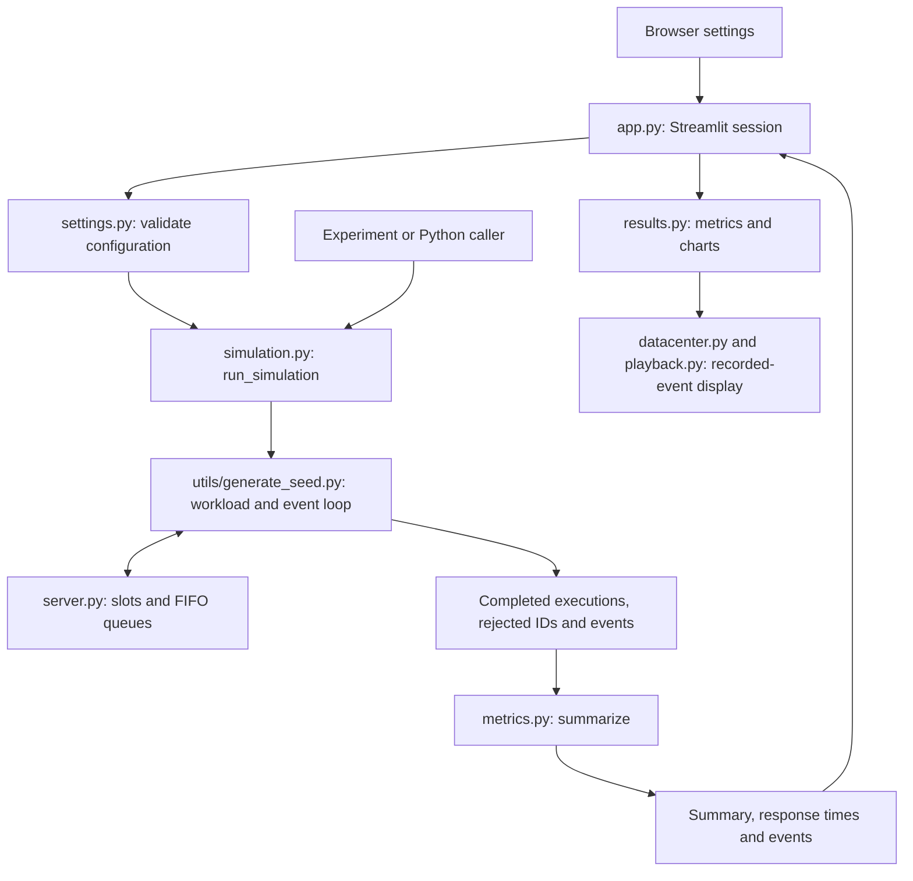

# Design Document

## Load balancing simulator: implemented design

This describes the working Demo 2 prototype on the `demo-2` submission branch
as of October 6, 2026,
including the D2-13 benchmark in commit `27393a4`. The app, examples, tests and
benchmark use implemented code and the checked-in lockfile. No future feature
or version is required to follow this document.

## 1. Architecture

The product is a local Streamlit app backed by an importable Python simulation
package. A simulation finishes before results are displayed. The modeled
workload uses no real HTTP requests, external workers, databases or cloud services.



| Module | Responsibility |
| --- | --- |
| `app.py` | Collect settings, run the model and retain the last successful config/summary in session state. |
| `settings.py` | Shared input validation for the form and simulation API. |
| `simulation.py` | Public `run_simulation(config) -> dict`: validate, route, summarize, attach response times and events. |
| `utils/generate_seed.py` | Generate the complete seeded workload, assign round-robin targets, process events and drain accepted work. |
| `server.py` | Request/execution records, bounded FIFO admission, concurrent slots and completion with immediate queue promotion. |
| `metrics.py` | Outcome counts, mean/p95 latency and per-server utilization. |
| `results.py` | Overview charts, metric cards and server details. |
| `datacenter.py`, `playback.py` | Server panels and recorded playback with time controls. |
| `experiments/scale_benchmark.py` | Fresh-process runtime/memory measurements, workload verification and saved evidence. |

### Configuration and lifecycle

All times are simulated seconds. Server IDs start at zero. Each request occupies
one execution slot for its full service time.

| Key | Meaning and validation |
| --- | --- |
| `server_count` | Positive integer number of identical servers. |
| `concurrency` | Positive integer execution slots per server. |
| `queue_limit` | Nonnegative integer waiting places per server, excluding running work. Zero disables waiting. |
| `arrival_rate` | Positive finite requests per simulated second. |
| `duration` | Positive finite arrival-window duration; also the utilization window. |
| `service_min`, `service_max` | Positive finite service bounds, minimum no greater than maximum. Equal bounds produce fixed service times. |
| `seed` | Integer; negative values are valid. |
| `policy` | Use `round_robin`. Validation recognizes `least_active_requests`, but the simulation rejects it because it is not implemented. |

The engine generates `N = int(arrival_rate * duration)` requests, IDs `0..N-1`.
Request `i` arrives at `i / arrival_rate`; service time is sampled with a local
`random.Random(seed).uniform(service_min, service_max)`. Generation precedes
routing. A positive rate/window produces an empty trace when their product is
less than one.

Round-robin assigns request `i` to server `i % server_count`, regardless of load.
A free slot starts work. Otherwise the selected server queues it in FIFO order
if space exists, or rejects it. There is no retry or alternate-server attempt.
Completion frees a slot and immediately starts the oldest queued request; the
engine schedules that request's completion.

Completions precede arrivals at equal timestamps. Pending completions sort by
`(completion_time, server_id, request_id)`, breaking completion ties by server ID
then request ID. Generated arrivals follow request-ID order. After the last
arrival, accepted work drains until no pending completions remain. The event
clock jumps between events without sleeping.

Recorded events have shape
`(time, server_id, running_count, waiting_count, action, request_id)`.
Counts describe the server after the event. Actions are `started`, `queued`,
`rejected` or `completed`. A completion that promotes queued work includes that
promotion in its counts; it emits no separate start event for the promotion.

### Metrics and returned data

`run_simulation` returns the dictionary below. Configuration remains a separate
input. For raw executions and rejected IDs, the lower-level
`route(**config, events=events)` returns `(completed_executions, rejected_request_ids)`.

| Summary key | Definition |
| --- | --- |
| `completed_count` | Requests completed after fully draining accepted work. |
| `rejected_count` | Requests whose selected server could neither run nor enqueue them. |
| `mean_response_time` | Mean `completion_time - arrival_time` for completed requests, including waiting and draining. |
| `p95_response_time` | Nearest-rank p95: sorted response time at zero-based index `ceil(0.95 * n) - 1`. |
| `per_server_utilization` | Server ID to occupied slot-seconds divided by `concurrency * duration`. Each execution contributes `max(0, min(completion_time, duration) - max(start_time, 0))`. |
| `response_times` | Completed-request response times in completion order. |
| `events` | Ordered admission/completion state changes for playback. |

Latency excludes rejected requests and includes completions after the arrival
window. Both latency values are `None` for no completions; the UI shows `N/A`.
Empty runs have zero counts and utilization. Utilization clips executions to
`[0, duration]`, excluding draining beyond the window. It measures modeled slot
occupancy, not CPU usage; for valid schedules it lies in `[0, 1]`. After draining,
completed plus rejected equals generated requests and every server is idle.
Tests and the benchmark check these properties.

## 2. Design decisions

- **Local Python and Streamlit:** one process serves the browser and direct
  experiments. Distributed services would add unnecessary operational complexity.
- **Event-driven execution:** jumping between events separates simulated time
  from machine scheduling; threads and sleeps would introduce timing variation.
- **Separate routing and admission:** the engine selects a target; `Server`
  owns slots, queue capacity and FIFO behavior, including rejection on a full target.
- **Repeatability:** a local random generator and new server objects isolate
  runs from each other and global random state. Implemented arrivals use fixed
  intervals rather than the exponential process discussed in the proposal.
- **Drain latency, clip utilization:** accepted requests finish before latency
  calculation, while occupancy stays tied to the arrival window.
- **Recorded playback:** replay changes the display clock using saved events;
  it does not re-route requests or change metrics.

No failed design experiment or optimization result is claimed here. The engine
uses Python lists, front removals and repeated sorting of pending completions.
The measured baseline is not presented as optimized.

## 3. Setup

Use Git, uv, a terminal and a browser. `.python-version` selects Python 3.12.
`uv sync --locked` creates `.venv`, installs the importable `lbsim` package and
uses `uv.lock`. Verification used Python 3.12.13 and Streamlit 1.65.0.
`pyproject.toml` permits Python `>=3.12,<3.15`, but these instructions use the
selected 3.12 environment. No GPU is required. Initial installation needs internet.

Install Git if absent. Install uv using its
[official instructions](https://docs.astral.sh/uv/getting-started/installation/).
For Windows with WinGet:

```powershell
winget install --id=astral-sh.uv -e
```

For macOS/Linux with curl:

```sh
curl -LsSf https://astral.sh/uv/install.sh | sh
```

Open a new terminal so uv is on `PATH`. From a parent directory where you want
the checkout, run these commands (PowerShell or Bash):

```sh
git clone --branch demo-2 https://github.com/ec528-fall26/load-balancing.git
cd load-balancing
uv sync --locked
uv run python --version
uv run python -m unittest discover -s tests -v
uv run streamlit run src/lbsim/app.py
```

For an existing checkout of this version, start at `uv sync --locked` in its
repository root. Environment activation and `PYTHONPATH` overrides are unnecessary
because uv installs the package. Open the printed local URL, usually
`http://localhost:8501`. Stop with Ctrl+C. If the port is occupied, append
`--server.port 8502` to the run command.

The existing suite contains 33 tests for validation, lifecycle, routing, metrics,
UI integration, playback and whole-run correctness. Success ends with
`Ran 33 tests` and `OK`.
Streamlit AppTest can print `missing ScriptRunContext` warnings during tests;
the assertions and final status determine success.

Verification was performed on Windows 11, AMD64, with 32 logical CPUs. The saved
10,000-request benchmark stayed below 39 MiB peak process memory per worker there.
This is measured usage, not a minimum RAM requirement or a bound for arbitrary
inputs. Linux/macOS instructions are provided but were not executed for this
document's verification.

### Interface

Enter sidebar settings and select **Run simulation**. Routing is fixed to
**Round robin**. A successful run replaces results; invalid submitted settings
show an error and clear prior results. Editing inputs alone does not run the model.

- **Overview:** outcome bars, completed-request latency histogram with p95, and
  per-server utilization.
- **Datacenter:** recorded playback or run-average utilization. Playback starts
  paused, supports play/pause, restart, seeking and 0.25x-10x speed, and includes
  draining. At 1x, one simulated second takes one real second. Racks group eight
  servers schematically; pages show up to 32 servers. Execution and waiting
  stacks are separate. Task-pool counts cover all servers, including those off page.
- **Server details:** utilization values behind the chart. The **Run
  configuration** expander shows settings for the displayed run.

### Short worked example: overload and draining

Use one server, one slot, one waiting place, 4 requests/s, a 1-second arrival
window, both service bounds 1 second, and seed 42. Reproduce it without a browser
with this command from the repository root:

```sh
uv run python -c "from lbsim.simulation import run_simulation; c=dict(server_count=1,concurrency=1,queue_limit=1,arrival_rate=4.0,duration=1.0,service_min=1.0,service_max=1.0,seed=42,policy='round_robin'); s=run_simulation(c); print({k:s[k] for k in ('completed_count','rejected_count','mean_response_time','p95_response_time','per_server_utilization','response_times')})"
```

Expected output:

```text
{'completed_count': 2, 'rejected_count': 2, 'mean_response_time': 1.375, 'p95_response_time': 1.75, 'per_server_utilization': {0: 1.0}, 'response_times': [1.0, 1.75]}
```

| Time (s) | Event | Running / waiting after event |
| ---: | --- | --- |
| 0 | Request 0 starts; completion scheduled at 1. | 1 / 0 |
| 0.25 | Request 1 queues. | 1 / 1 |
| 0.5 | Request 2 is rejected. | 1 / 1 |
| 0.75 | Request 3 is rejected. | 1 / 1 |
| 1 | Request 0 completes; request 1 immediately starts. | 1 / 0 |
| 2 | Request 1 completes; server is idle. | 0 / 0 |

Request 1 waits 0.75 seconds and runs for 1 second: response time is 1.75 seconds.
Mean response time is `(1 + 1.75) / 2 = 1.375` seconds. The slot occupies the
entire arrival window, giving 100% utilization. Completion at 2 seconds contributes
to latency; occupancy after 1 second does not contribute to utilization. UI cards
show `2`, `2`, `1.375 s` and `1.750 s`. Seek to 0.25 seconds to see one running
and one waiting request, then to 2 seconds to see two completed, two rejected
and zero running/waiting.

For a normal run, keep other settings and change both service bounds to 0.1 seconds.
All four requests complete, none are rejected, mean/p95 are 0.100 seconds and
server utilization is 40%.

## 4. Running the experiments

The existing benchmark measures the full `run_simulation` call, including
generation, routing, event recording, draining and metrics. Each sample uses
a fresh process. Startup/imports and post-run checks are excluded from timing.
Peak memory is the OS process high-water mark, including interpreter/imports,
read before post-run validation; it is not incremental or whole-machine memory.

### Experiment 1: D2-13 round-robin scale baseline

| | |
| --- | --- |
| Supports | Local baseline runtime and peak process memory for the same 10,000-request trace with 10, 100 and 1,000 servers. |
| Setup | From the repository root, install uv and run `uv sync --locked` (Python 3.12 is selected by `.python-version`). |
| Command | `uv run python experiments/scale_benchmark.py --repeats 3 --output experiments/results/d2-13-rerun` |
| Expected runtime | Typically under one minute on the recorded machine; each worker has a 120-second timeout. |
| Expected output | Nine sample lines, followed by `trace.csv`, `samples.csv`, and `report.json` in the chosen directory. A different directory preserves the saved baseline. |

The script checks the actual generated trace against the saved trace's SHA-256 for every sample, verifies seeded replay and request conservation, and checks that every server is idle after draining. Counts and trace hashes should match the recorded run; wall-clock time and peak memory vary by machine and load. This experiment is a round-robin baseline, not a comparison of routing policies.

The workload uses 100 requests/s for 100 seconds, seed 42, service times 0.1-1.0
seconds, one slot and ten waiting places per server. Recorded Windows baseline,
three samples per server count:

| Servers | Median runtime (s) | Maximum peak process memory (MiB) | Completed | Rejected |
| --- | ---: | ---: | ---: | ---: |
| 10 | 0.0752 | 35.41 | 1,905 | 8,095 |
| 100 | 0.1351 | 37.79 | 10,000 | 0 |
| 1,000 | 0.1275 | 38.66 | 10,000 | 0 |

See [methodology](../experiments/README.md),
[raw samples](../experiments/results/d2-13/samples.csv),
[machine/configuration report](../experiments/results/d2-13/report.json) and
[trace](../experiments/results/d2-13/trace.csv). Increasing server count also adds
capacity. Ten servers reject most requests. These results do not isolate the
cost of server count or prove 1,000 servers faster than 100.

## 5. Claims and limitations

The prototype provides configurable identical servers, fixed-interval seeded
traffic, round-robin routing, bounded FIFO queues, draining, charts, recorded
playback and a reproducible local baseline.

- Only round-robin runs; there is no working policy comparison.
- Arrivals are evenly spaced; bursty/exponential traffic is not modeled.
  Request count truncates to `int(arrival_rate * duration)`.
- Concurrency defines capacity. Hardware speeds, CPU/memory pressure,
  failures/reliability, regions, network delay, retries and preemption are not modeled.
- Configuration/results live in Streamlit session state. The UI does not export,
  import, persist or compare saved runs. Benchmark CSV/JSON files are experiment
  artifacts, not a general UI export/reload feature.
- Playback refreshes five times per second. Short events can fall between frames,
  while replay counts process every event. Racks are display organization, not topology.
- The engine stores the workload/event log in memory and uses list front removals
  and completion sorting. There is no resource cap for arbitrary configurations;
  large runs can block the synchronous UI or exhaust RAM.
- The baseline covers one seed/workload and three repetitions on one machine.
  It establishes local measurements, not cloud performance, production guarantees,
  optimized complexity or a general scalability bound.

This document is usable with the current implementation. It does not assert
completion of slides, a demo recording or release-branch submission; those are
separate deliverables.
