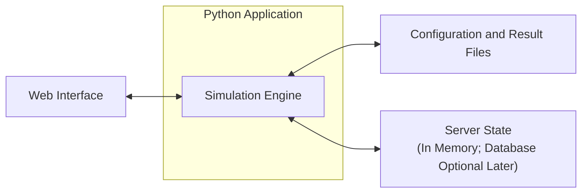

# Load Balancing Simulator - Design Proposal

**Team:** Daniel Thomas, Kimone Walker, Neev Jain, Sean O'Connor

**Mentor:** Shripad Nadgowda, Meta

**Course:** BU EC528, Fall 2026

**Date:** September 17, 2026

**Record:** Demo 1 proposal; consolidated after grading on October 6, 2026. The original PDF is retained alongside this Markdown version; the Markdown includes the architecture diagram added during preparation.

## 1. Problem and proposed product

Changing a load-balancing policy or increasing traffic can overload some servers while leaving others underused. Testing these changes in production can affect real users.

We will build a small web application for exploring these changes through simulation. A user chooses the number of servers, the amount of incoming traffic, and a load-balancing policy. The application runs the simulation and shows how requests are distributed, how busy the servers become, and how long requests take.

The main question is: **what changes when we send the same workload through a different policy, or increase the traffic?** Results describe our simplified model; they are not guarantees about a production system.

## 2. Basic goals

These are the proposed core commitments for the project.

1. **Configure a simulation.** Set server count, server size, reliability, requests per second, request-duration range, server concurrency limit, queue limit, and simulation duration. Start with identical servers in one region.
2. **Generate repeatable traffic.** Save the configuration and random seed so an experiment can be repeated with the same arrivals and request durations.
3. **Compare two policies.** Implement round-robin and least-active-requests, which selects the server with the fewest running requests. Use a fixed rule to break ties.
4. **Track the full request lifecycle.** Requests arrive, are assigned, run or wait in a queue, and finish. Finishing a request frees capacity. A full queue causes rejection.
5. **Show useful results.** Display per-server utilization, completed and rejected requests, and average and p95 response time. Allow comparison of two saved results.
6. **Make experiments reproducible.** Export configurations and results as files and provide a script that reruns the evaluation scenarios.

“Least-active-requests” refers to running requests, not open network connections. Both policies use the same server and queue rules.

## 3. Simple architecture

The initial product runs locally as one application, with a simple web interface. The simulation engine is a Python module that can also be called by experiment scripts. We will choose a lightweight interface framework during implementation.

Each simulated server is an object in memory. Configuration and results are saved as JSON or CSV files. A separate database, job queue, and distributed worker system are advanced options rather than requirements for the first version.

### How the simulation works

The engine advances simulated time to the next arrival or completion. It does not wait for requests to finish in real time.

- Each server can run a configured number of requests at once.
- Each request has a generated service duration and occupies one slot while running.
- If the selected server is busy, the request waits in its bounded first-in, first-out queue. If that queue is full, the request is rejected.
- A completion frees a slot and starts the next queued request.
- Response time includes waiting time and service time. Utilization is the fraction of execution slots occupied over time; it is not a measurement of real CPU usage.

Completions are processed before arrivals at the same timestamp. Both policies receive the same generated workload. At the end of the arrival period, the engine finishes accepted work before reporting final latency results; utilization is measured over the arrival period.

The basic model omits memory pressure, network delay, retries, and hardware differences. Those can be added once the core behavior is correct.

## 4. Advanced goals

These are optional extensions. We will select a small number with the mentor after the basic simulator works, rather than promise every feature.

| Goal | What it adds |
| :---- | :---- |
| Different server types | Model faster/slower servers and different capacities; add CPU or memory demand to request profiles |
| More policies | Compare capacity-weighted routing, least-resource-use, or other mentor-selected policies |
| Regions and network delay | Explore how server location contributes to response time, with explicit routing rules |
| Failures and stale information | Simulate unavailable servers or delayed load updates and measure the effect on decisions |
| Database-backed state | Store and query server state through Redis or SQL to explore the state-management design discussed with the mentor |
| Cloud deployment and containers | Host the application in the cloud or build a small container-based testbed for comparison with the model |
| Larger experiments | Improve simulation runtime and memory usage, or run independent experiments in parallel |

## 5. Technical challenge and evaluation

The main challenge is keeping routing decisions, queues, and server load consistent as requests arrive and finish. The comparison must also be fair: each policy must see the same workload, and lower rejection rates must be considered alongside waiting time.

We will evaluate the basic product in three ways:

- **Correctness:** Check small examples by hand, including one server, two servers, simultaneous arrivals/completions, and a full queue. After a run finishes, every request must be completed or rejected, with no occupied slots left over.
- **Repeatability:** The same configuration, seed, and policy must produce the same simulated results.
- **Policy comparison:** Run both policies on the same workloads at low, near-capacity, and overloaded traffic levels, plus a scenario with 20% more traffic. Repeat each scenario with three seeds and report variation.

For simulator performance, record runtime and peak memory for 10, 100, and 1,000 simulated servers processing the same 10,000-request trace on a documented machine. These are initial evaluation sizes, not a claim that they represent production scale.

For Demo 3, we will profile the Demo 2 implementation, improve a measured bottleneck or inconsistency, and repeat the same benchmark. The goal is to improve the general user experience and platform usability, while preserving or improving simulated results.

## 6. Milestones

All submissions are due at **12:00 noon**, in the specified GitHub branch.

| Milestone | Date / branch | Deliverable and evidence |
| :---- | :---- | :---- |
| **Demo 1: design** | Sept. 23 / `demo-1` | Proposal and slides covering the model, architecture, basic goals, advanced options, and division of work |
| **Demo 2: basic product** | Oct. 21 / `demo-2` | Working interface and simulation with at least one policy, result viewing, correctness and replay checks, and baseline experiment outputs; include code, slides, design document, and demo video |
| **Demo 3: improvement** | Nov. 16 / `demo-3` | Completed policy-comparison suite and policy implementation; simulation saving and replaying; updated code, slides, design document, and demo video. Demonstrate selected advanced features if ready |
| **Final: reproducible delivery** | Dec. 9 / `final-demo` | Finished application, experiment templates, final report and setup instructions, slides, and recorded presentation; reproduce all reported results from a clean setup |

Advanced goals become commitments only after the team and mentor agree on their scope and evidence. Any changes to committed milestones will be explained at the relevant demo.
